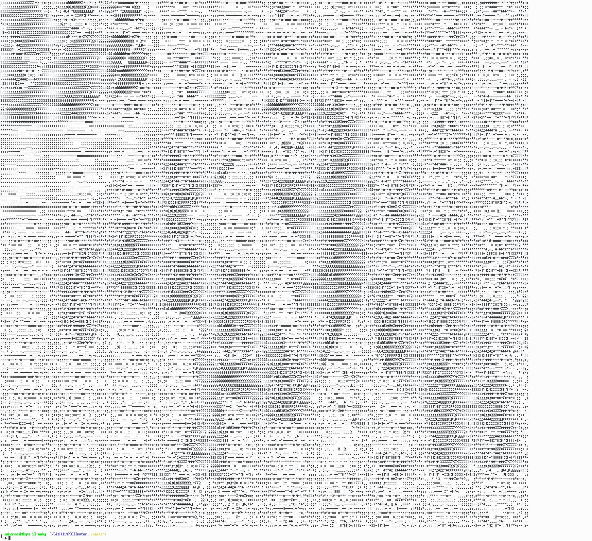
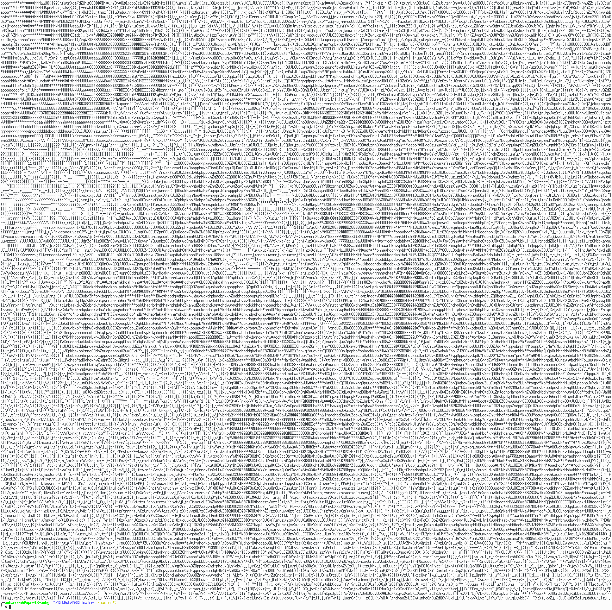

# ASCIInator

A python program that converts images into ASCII art and pixel art.
(NOTE: ensure that your terminal supports ISO-8613-3 24-bit foreground color setting for outputing pixel art correctly. macOS's default terminal is not known to support it. Use iTerm2.)

Authors: Yash Mathur (@YashMathur), Ambareesh Balaji (@ambyjkl)

## Demo
ASCII art:



ASCII art with high detail:



Pixel art:


# Installation

## macOS
```bash
brew install python3 pip3
sudo pip3 install Pillow
git clone https://github.com/YashMathur/ASCIInator.git
cd ASCIInator
python3 main.py -h
```

## Ubuntu / Bash on Windows 10
```bash
sudo apt-get install python3 pip3
sudo pip3 install pillow
git clone https://github.com/YashMathur/ASCIInator.git
cd ASCIInator
python3 main.py -h
```

## Arch Linux
```bash
sudo pacman -S python-pillow
git clone https://github.com/YashMathur/ASCIInator.git
cd ASCIInator
python main.py -h
```
